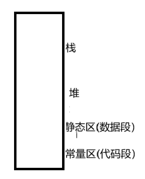
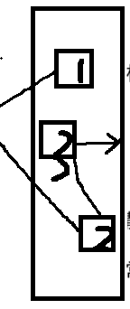

## 顺序表_链表
### 线性表
`逻辑上是连续的` 

`顺序表，链表，栈 这些都被叫成线性表`
- 数据结构实际分为两种结构

    1. 物理结构(内存中如何存)
    2. 逻辑结构(想象出来的)
- 线性表
`线性表指逻辑上是连续的,逻辑是想象出来的`

    - 物理结构:数组，链表
        -  *数组*  
         -> 物理上和结构上都是连续的

        `缺陷:不清楚要存多少个，不能按需索取`
        - 链表
            - 在堆上方便按需索取
            - 
            - 在逻辑上是连续的，但在线性不一定是线性的
            - 可能在内存中是这样开辟的，所以物理上不一定连续
            !
> 栈是向下生长的，堆是向上生长的

